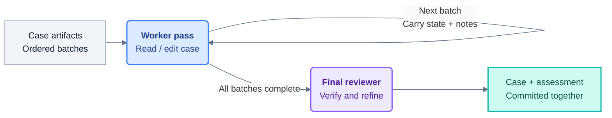

# RAFT

### A Stateful Retrieval-Augmented Framework for Troubleshooting Agents

[](pyproject.toml)
[](https://github.com/openai/openai-agents-python)
[](LICENSE)
[](https://arxiv.org/abs/2609.20754)

*Accepted to **EMNLP 2026, Industry Track**. [Read the paper on arXiv](https://arxiv.org/abs/2609.20754).*

[](assets/raft-hero.svg)

RAFT is built for **technical support cases where resolution takes an investigation,
not a single answer**:

**Initial symptoms → investigation → root-cause confirmation → resolution or mitigation**

It distills noisy conversations, logs, and notes into searchable case trajectories,
with configurable filtering for cases that offer no reusable technical insight.
Your troubleshooting agents can find similar cases at **the right stage of the
investigation**—with the evidence, diagnostic steps, and resolution path together,
rather than scattered across disconnected chunks.

[Overview](#overview) · [Per-case extraction](#per-case-extraction-workflow) · [Quickstart](#quickstart) · [Production usage](#production-usage) · [Citation](#paper-and-citation)

## Overview

[](assets/raft-overview.png)

*Your troubleshooting agent re-queries RAFT as the active case evolves.*

1. **Distill the case.** Turn dialogue, logs, and notes into a chronological
   timeline of meaningful changes: symptoms, hypotheses, findings, and resolution.
2. **Match the state.** Embed each timeline entry independently and combine vector
   similarity with BM25 through reciprocal rank fusion.
3. **Return the trajectory.** Return distinct cases with their full investigation
   history and the timeline entry that triggered each match.

An **optional case-level graph** connects cases through a configurable view, such
as root cause and resolution, for expansion beyond the initial matches.

## Per-case extraction workflow



RAFT uses the **[OpenAI Agents SDK](https://github.com/openai/openai-agents-python)**
as its agent backend to process each case through a **worker + final reviewer** workflow:

- **Worker passes** process ordered, whole-artifact batches and refine shared state
  through JSON Patch. State and handoff notes carry forward, rather than the entire
  conversation.
- **Evidence tools** provide selective, read-only SQL access to source artifacts.
  Workers can also use application-defined tools, such as an error-code lookup.
- **Final review** checks the completed extraction against evidence and revision
  history, corrects the state, and returns a separate assessment before optional filtering.

Adapt the [default prompts](src/raft/defaults/prompts.py), Pydantic models,
embedding text, and model clients to your domain without changing the pipeline.
The [example notebook](examples/jira_walkthrough.ipynb) shows how.
For focused Python examples, see [models and prompts](examples/custom_extraction.py),
[text formatters](examples/custom_text.py), [agents and tools](examples/custom_agents.py),
and [static or weighted per-run configuration](examples/model_routing.py).

## Quickstart

### 1. Install

Python **3.11+** is required. A Conda environment is optional.

```bash
git clone https://github.com/microsoft/RAFT.git
cd RAFT

conda create -n raft python=3.12 -y
conda activate raft
python -m pip install -e .
```

Optional extras: `azure` for Entra authentication, `voyage` for Voyage embeddings,
and `dev` for development tools.

### 2. Configure credentials

For example, to use OpenAI, create a local `.env` in the repository root or set:

```dotenv
OPENAI_API_KEY=your-api-key
```

For other models, providers, and authentication options, see the OpenAI Agents SDK
[models](https://openai.github.io/openai-agents-python/models/) and
[configuration](https://openai.github.io/openai-agents-python/config/) guides.

### 3. Initialize, index, and retrieve

Use the `extraction` and `embedding` settings from the
[example notebook](examples/jira_walkthrough.ipynb):

```python
from raft import LocalPipeline

pipeline = LocalPipeline("outputs/demo", extraction=extraction, embedding=embedding)
texts = [
    "SSO login failed. Replacing the expired certificate restored access.",
    "Uploads timed out. Increasing the proxy timeout fixed the issue.",
    "Requests returned stale data. Clearing the cache resolved the problem.",
]
await pipeline.index([
    {"id": f"case-{i}", "metadata": {}, "artifacts": [{"text": text}]}
    for i, text in enumerate(texts)
])

results = await pipeline.retrieve(["SSO login fails after certificate rotation."], top_k=3)
for result in results["results"]:
    if result["error"]:
        raise RuntimeError(result["error"])
    print(result["formatted_context"])
```

`top_k` limits distinct cases per query. Structured matches remain available
in `candidates`.
Supply `format_case(hit) -> str` to customize the text using the full case and
matched entry index. See the [notebook](examples/jira_walkthrough.ipynb) for
formatting, filtering, and optional graph expansion.

## Production usage

Use RAFT's standalone **extraction and embedding stages** in production pipelines.
They support bounded batches, configurable concurrency/retries, and per-case failures,
returning results in memory without saving them. `LocalPipeline` is for quick local
experiments.

**Adapt RAFT to your historical cases.** We strongly recommend equipping both
the worker and reviewer with tools to search your private knowledge base, internal
documentation, and error catalogs. Add background context about your products,
terminology, and case data to their instructions. Replace the generic `entities`
field in the [default output model](src/raft/defaults/extraction.py) with
application-specific identifiers and attributes for filtering and knowledge lookup.
Tailor the reviewer's instructions and acceptance criteria to what makes an
extracted case accurate and useful for your application.

Timeline entries are a key part of RAFT's design. Modifications are welcome,
though we recommend keeping the core idea intact.

Process cases incrementally and store/search the results in a service such as
**[Microsoft Azure AI Search](https://learn.microsoft.com/en-us/azure/search/)**,
which supports vector and hybrid retrieval.

```python
# Pseudocode: configure agents/models once; source, storage, and retry queue are yours.
from raft import run_cases, embed_cases

async for batch in case_source.batches(size=100):
    extracted = await run_cases(cases=batch, **extraction_options)
    embedded = await embed_cases(
        cases=extracted["extracted_cases"], **embedding_options
    )
    await production_index.upsert(embedded["embedded_cases"])
    await retry_queue.enqueue(
        extracted["failed_cases"] + embedded["failed_cases"]
    )
```

## Explore the code

| Start here | What it contains |
|---|---|
| [Jira walkthrough](examples/jira_walkthrough.ipynb) | End-to-end notebook with customization notes |
| [Defaults](src/raft/defaults/) | Extraction/review schemas, prompts, and text preparation |
| [Extraction](src/raft/extraction/) | Worker passes, evidence access, state edits, and review |
| [LocalPipeline](src/raft/pipeline.py) | Persistent indexing, reopening, and incremental updates |
| [Retrieval](src/raft/retrieval/) | Entry ranking, case promotion, filtering, and budgets |
| [Graph](src/raft/graph/) | Optional case linking and neighbor expansion |

## Paper and citation

**RAFT: A Stateful Retrieval-Augmented Framework for Troubleshooting Agents**

Mingxuan Zhang, Xiaowen Wang, Anupma Sharan, Zhengyi Chen, Chenyu Diana Zhang,
Shanshan Yang, and Chittibabu Pacharu. Microsoft.

**[arXiv:2609.20754](https://arxiv.org/abs/2609.20754)**

```bibtex
@misc{zhang2026raft,
  title  = {RAFT: A Stateful Retrieval-Augmented Framework for Troubleshooting Agents},
  author = {Zhang, Mingxuan and Wang, Xiaowen and Sharan, Anupma and Chen, Zhengyi
            and Zhang, Chenyu Diana and Yang, Shanshan and Pacharu, Chittibabu},
  year   = {2026},
  eprint = {2609.20754},
  archivePrefix = {arXiv},
  url    = {https://arxiv.org/abs/2609.20754},
  note   = {Accepted to EMNLP 2026, Industry Track}
}
```

## License and contributing

Released under the [MIT License](LICENSE). Contributions are welcome; please follow
the [Microsoft Open Source Code of Conduct](CODE_OF_CONDUCT.md). Report security
issues through the process in [SECURITY.md](SECURITY.md), not a public issue.
