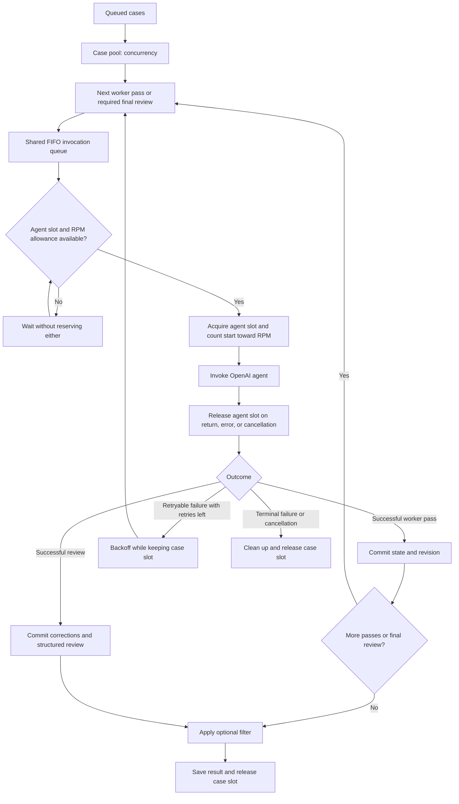
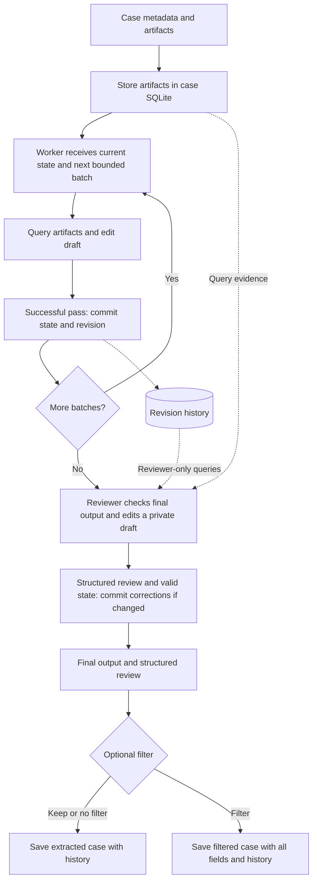

# RAFT: case extraction and embedding

RAFT distills support cases into chronological troubleshooting states and embeds
each timeline entry independently. This package implements extraction, embedding,
local BM25 indexing, and an optional case-level hybrid graph. Extraction,
and embedding return in-memory data without saving anything.
`LocalPipeline` adds local persistence, ID-based updates, stage resumption, and
async retrieval. Standalone processing stages remain storage-free.

## Install and run

Python 3.11+; run from this repository:

```bash
python -m pip install -e '.[dev,voyage]'
python -m pytest -q
python examples/pipeline.py
```

OpenAI Agents SDK and the OpenAI client are included in the standard installation:

```bash
pip install -e .
pip install -e '.[voyage]'  # Add Voyage embeddings when needed.
```

Optional extras are `azure` (Microsoft Entra authentication), `voyage`,
`notebook` (progress widgets), and `dev`.

The live example needs `OPENAI_API_KEY` and `VOYAGE_API_KEY`.
It loads the repository `.env`, uses `gpt-5.2` for extraction
and `voyage-4` for embeddings, and writes to `outputs/demo/`.
It includes a small resolved case, a larger case requiring worker passes, an RFI
case to filter, an application-defined lookup tool, and the optional case graph.
Repeated runs skip existing IDs; use `rewrite=True` to replace them. Running it
makes billable API calls. The separate snapshot examples expect explicitly saved
`extraction.json`/`embeddings.jsonl` files (see the storage helpers), not the pipeline
catalog. For example, to embed a saved extraction snapshot:

```bash
python examples/embed_saved.py
```

## Notebook walkthrough

Open [the local pipeline notebook](examples/notebooks/local_pipeline_walkthrough.ipynb)
for a live walkthrough with 100 synthetic support cases. It shows standalone
extraction, revision/tool traces, timeline embeddings, graph construction, and
`LocalPipeline` indexing, retrieval, graph expansion, incremental updates, and reopening.
It loads `OPENAI_API_KEY` from the environment or `.env` and makes billable calls.
Set `CASE_LIMIT=5` for a smaller first run; the default is 100.

```bash
python -m pip install -e '.[notebook]' jupyterlab python-dotenv
python -m jupyterlab examples/notebooks/local_pipeline_walkthrough.ipynb
```

The small generator and JSONL dataset live next to the notebook. Local pipeline
outputs go into a new `outputs/notebook-demo/live-<run-id>/` directory on each run.

## Code layout

```text
src/raft/
  defaults/
    extraction.py      Default Entity, TimelineEntry, CaseExtraction, CaseReview models
    prompts.py         Worker and final-reviewer instructions (plain strings)
    text.py            Default state_to_text and case_to_text functions
  extraction/
    runner.py          Worker passes and per-case orchestration
    context.py         Isolated SQLite case data and query limits
    state.py           Atomic JSON Patch application and final validation
    batching.py        Ordered batches of whole source artifacts
    coverage.py        Runner-owned coverage of committed batch content
    prompts.py         Worker pass context construction
    _agent.py          Native OpenAI execution and validation
    _openai_telemetry.py  Native usage and ordered tool calls
  embedding/
    runner.py          Storage-free per-case item embedding and batching
    backend.py         Interface for another embedding provider
    openai.py          Async OpenAI embedding client adapter
    voyage.py          Async Voyage embedding client adapter
    bm25.py            BM25S index build, save/load, and lexical search
  graph/
    runner.py          In-memory case-level embedding and graph construction
    filters.py         Python predicates over original case records
    neighbors.py       Filtered cosine/BM25 RRF neighbors and SNN edge weights
    expansion.py       Reusable one-hop expansion and adjacency preparation
  retrieval/
    local.py           Reusable local snapshot, async query execution and loading
    ranking.py         Entry ranking, distinct-case promotion and character budgets
  tools.py             Prebuilt OpenAI SQL and JSON Patch tools
  runtime.py           Bounded concurrency, RPM, and retry helpers
  storage.py           Explicit embedding/graph snapshots and JSON/JSONL utilities
  cases.py             Canonical case validation and saved-model restoration
  local_store.py       Atomic case catalog and single-writer directory lock
  pipeline.py          LocalPipeline with async index/retrieve and ID-based updates
examples/              Assemble defaults with application-owned agents, tools, clients
tests/                 Offline component and pipeline tests
```

## Defaults and customization

Start with `src/raft/defaults/`: the extraction and review Pydantic models,
worker/reviewer instruction strings, and text-preparation functions.

```python
from raft.defaults import (
    CaseExtraction, CaseReview, WORKER_INSTRUCTIONS, REVIEWER_INSTRUCTIONS,
    state_to_text, case_to_text,
)
```

These are optional imports, not settings applied implicitly by the runner. Supply
your own Pydantic model as the runner's `output_type`, your own string as the agent's
`instructions`, and your own callback as embedding's `state_to_text`. No factory,
template engine, subclass, or package-file edits are required. To extend the
default instructions, simply concatenate a string.

`WORKER_INSTRUCTIONS` explains extraction, SQL reads, state editing, and finishing
in one or more passes. It is an editable string in `defaults/prompts.py`.
`extraction/prompts.py` only formats dynamic case/pass data: schema, current state,
coverage, preloaded batch content, budgets, and validation errors. It does not inject separate instructions.
If you write a custom worker prompt, retain the `edit_state` completion contract.
`case_to_text` defaults to root cause plus resolution, falling back to the final
timeline entry. Both text functions accept your complete extraction model.

The defaults preserve the legacy v4 support-case semantics: verbatim `entities`,
chronological `timeline` narratives (at least 200 characters), confirmed
`root_cause` (up to 800 characters), and actual `resolution_steps` (up to 1200
characters). Unknown conclusions must be explicit `null`; diagnostic work belongs
in the timeline, not the fix. Narratives describe material changes in understanding
and remain independently retrievable. `handoff_notes` carries context across passes.

The old single-agent `InteractionGraph` / `NodeDelta` protocol is **not** retained.
Workers edit cumulative state and can correct previous conclusions; they do not
emit terminal flags or an early verdict. The final reviewer verifies and can repair
the complete extraction, then returns a separate `CaseReview`. Reusable RFI/guidance
and unconfirmed troubleshooting remain eligible; only content-free noise is filtered.
The schema rejects unknown fields, blank conclusions, and inconsistent assessments.
These stricter checks intentionally expose malformed output rather than silently
dropping it. Core extraction fields are required; only `handoff_notes` defaults to `[]`.

## Local MS Learn experiment

The local-only MS Learn files belong under `datasets/mslearn/`:
`all_cases.json` and `all_unresolved_cases.json`. This entire folder and `outputs/`
are gitignored; neither the data nor generated extractions are distributed.

```bash
python -m pip install -e '.[dev]'
python examples/mslearn_smoke.py --full --dry-run
python examples/mslearn_smoke.py --full
```

The live command makes billable calls using `OPENAI_API_KEY` from the environment
or repository `.env`. It uses `gpt-5.4` with medium reasoning, the legacy embedding
model `text-embedding-3-large`, seed **1**, and conversation progress **0%, 30%, 60%**.
Progress selects messages `0..floor(progress / 100 * (n - 1))`, inclusive; 0%
means the first message, not an empty query. This seed controls the data split,
not model-generation determinism.

`--full` reproduces the original notebook's seeded shuffle and split: select up to
1000 test cases with distinct `shared_id` values, then index **every remaining case**.
For the local 826-record dataset this means **361 held-out cases, 465 indexed cases,
and 1083 queries**. The 20 holdouts with no indexed counterpart are intentionally
retained in the denominator; they are not dropped or replaced with easier pairs.
Query strings and ordered split IDs are identical to the notebook for seed 1.

Full mode uses **top-10** hybrid BM25/vector retrieval and the notebook's **4000-token
context budget**: estimate each formatted case as `len(text) // 4`, retaining the
first case that crosses the budget, as the old implementation did. Case hit is
`shared_id in [case_id.split("_")[0] for case_id in retrieved_cases]`. The saved
metrics include both the post-budget case hit and pre-budget top-10 hits.
Only case hit is evaluated: **no graph, graph expansion, or LLM judge**.

Extraction and retrieval use the **new workflow and migrated defaults**, not the
old single-agent implementation. Full-case source batches use the normal 400,000
character limit, so short cases do not incur artificial extra worker passes.
The notebook's obsolete `node_summary` / `actions_taken` context fields are mapped
to metadata, root cause, resolution steps, and the final timeline narrative.
BM25 and vector ranking use the new implementation's narrative entries. Thus the
dataset, split, queries, top-k, budget procedure, and metric match the old test;
the extraction representation and retrieval implementation intentionally differ.

The run saves schemas, exact prompts, configuration, dataset hash, split IDs,
revisions, extracted output, retrieval results, and metrics to `outputs/mslearn/`.
Ground-truth `synthetic_information` is used only for split selection and scoring,
never supplied to an extraction agent or query. Successful indexing is checkpointed;
failed cases are retried without repeating successful work. To resume the same run,
repeat its arguments with `--output-dir PATH --resume`; configuration, prompts, and
schemas must match. Saved original-attempt failures remain available in execution
telemetry; `index_summary.json` reports the latest indexing attempt.

Omit `--full` only for an explicit small smoke check: three paired holdouts,
twelve indexed cases, top-5, and 4000-character source batches to exercise multiple
worker passes. This small mode is not the full experiment; `--test-cases` and
`--index-cases` control its sample sizes.

For the existing Azure OpenAI deployments, use Microsoft Entra login without
copying credentials into this repository:

```bash
python -m pip install -e '.[dev,azure]'
az login
python examples/mslearn_smoke.py --full --azure-endpoint https://YOUR-RESOURCE.openai.azure.com
```

The Azure option uses your existing Azure CLI identity and the Azure OpenAI v1
endpoint. Deployment names can be overridden with `--model` and `--embedding-model`.
`--dry-run` inspects the data split without network calls or credentials.
Defaults are `--concurrency 80 --rpm 100`, matching the
legacy extraction concurrency and RPM settings with the requested GPT-5.4 model.
The output token cap is 8000 in full mode and 4000 in small smoke mode.
RPM limits worker/reviewer invocations, not individual model turns or token usage;
reduce concurrency/RPM if your deployment is throttled. Embedding uses concurrency
200 / 700 RPM and retrieval uses concurrency 60 / 200 RPM. Model and extraction
limit overrides are recorded in the run manifest.
Azure HTTP calls retry up to six times before the case-level retry policy runs.
When Azure supplies a token-window reset but no `Retry-After`, the example maps
that reset to the native client's retry delay. This retries the throttled request
without throwing away successful model/tool turns and restarting the worker pass.

## Extraction

Input is a list of dictionaries. Specify fields containing the unique identifier,
raw artifact list, and metadata dictionary. Artifacts keep their original order
unless `artifact_sort_field` is set. Sorting is stable, ascending, and places
missing values last. Use consistently typed numeric keys or normalized ISO
timestamps for chronological sorting. Inputs and caller-owned agents are not mutated.

Define a worker and a required reviewer in your application:

```python
from agents import Agent
from raft import run_cases
from raft.tools import query_case_sql, edit_state
from raft.defaults import CaseExtraction, CaseReview, WORKER_INSTRUCTIONS, REVIEWER_INSTRUCTIONS

worker = Agent(
    name="Case worker",
    instructions=WORKER_INSTRUCTIONS,
    tools=[query_case_sql, edit_state],  # Add your other tools here too.
    # model=your_model,
)

reviewer = Agent(
    name="Final reviewer",
    instructions=REVIEWER_INSTRUCTIONS,
    tools=[query_case_sql, edit_state],
    output_type=CaseReview,
)

# Inside your async application:
result = await run_cases(
    cases=cases,
    worker_agent=worker,
    reviewer_agent=reviewer,
    output_type=CaseExtraction,
    id_field="ticket_number",
    artifacts_field="artifacts",
    metadata_field="metadata",
    artifact_sort_field="timestamp",
    max_batch_chars=400_000,
    max_query_chars=50_000,
    concurrency=4,
    agent_concurrency=2,
    timeout=300,
    retries=1,
    rpm=30,
)
```

Supply the final Pydantic model explicitly as `output_type=CaseExtraction`.
Extraction imposes no timeline field names or business schema. Worker state can
represent any JSON value accepted by the final model, including RootModel. The
worker edits state through tools, without using the model's structured-output API.
Non-JSON Python objects cannot be used as editable state.

### Optional OpenAI run configuration

`run_cases(..., run_config=...)` accepts a native `agents.RunConfig` or a
sync/async callback `(agent, context) -> RunConfig`. Omit it (or pass `None`) to
retain the default `RunConfig(tracing_disabled=True)`. Supplied settings are
respected, including tracing; RAFT does not mutate the configuration or agent.

```python
import random
from agents import RunConfig

# A fixed configuration:
run_config = RunConfig(tracing_disabled=False, trace_include_sensitive_data=False)

# Or choose from your initialized SDK model objects and their clients per run.
# worker_models/reviewer_models are caller-owned lists; weights are relative.
def configure_run(agent, context):
    models = reviewer_models if context.stage == "reviewer" else worker_models
    return RunConfig(
        model=random.choices(models, weights=[70, 30], k=1)[0],
        tracing_disabled=True,
    )

run_config = configure_run
# Supply run_config=run_config to run_cases(), or in LocalPipeline's extraction dict.
```

The callback receives the actual worker/reviewer agent and `CaseContext`, including
`case_id`, `metadata`, and `stage` (`"worker"` or `"reviewer"`). It is evaluated once
after scheduler admission for each worker pass, review, or retry, not on every
model turn. Returning a concrete model in `RunConfig.model` keeps that selection
for the SDK run and overrides models on any handoff agents in that run as well.
Callbacks may run concurrently and should keep routing choices local to each call.
RAFT still supplies case context, telemetry hooks, and `max_turns` separately.

### Progress display

Set `show_progress=True` on `run_cases`, `embed_cases`, `build_case_graph`, or
`LocalRetriever.retrieve`. It defaults to False. `LocalPipeline(show_progress=True, ...)`
enables progress across its runners and retrieval; an explicit `show_progress` in
an extraction, embedding, or graph configuration overrides that stage.

Bars use `tqdm.auto` for terminal or notebook display. For notebook widgets, install
`pip install "raft[notebook]"`; terminal progress needs no extra installation.
Extraction and embedding advance once per finished case, with `succeeded` and `failed`
counters. Filtered extraction cases and skipped embedding cases have separate counters.
Passes, retries, and waiting agent runs do not inflate these counts. Graph construction
shows embedding and neighbor progress; retrieval counts queries. Cached stages are
not rerun for display, and disabling progress leaves returned results unchanged.

### Worker passes and budgets

Every case uses the same worker workflow. The outer loop preloads the next ordered
batch into each agent invocation. A small case can finish in one pass; larger cases
continue automatically until every source artifact has been supplied in a successful
pass and the final state validates. All successful cases receive full coverage;
there is no agent-controlled early exit, including for RFI/test/duplicate cases.

- `max_batch_chars` (default 400,000): source artifact JSON characters per preloaded batch.
  Artifacts remain whole. Before the first agent invocation for each case, RAFT checks
  every serialized artifact. An oversized artifact fails that case with
  `error_category="artifact_too_large"` and `retryable=False`, without an agent call
  or retry. Other cases continue. Failure `details` include the sorted and original
  artifact positions, character count, and limit. Split it upstream or increase the limit.
- `max_query_chars` (default 50,000): characters in the complete serialized SQL response per call.
  Each query has its own cap; there is no cumulative per-pass SQL budget.
  Includes the response wrapper, column names, JSON escaping, and row separators.
  Measured with `json.dumps(response, ensure_ascii=False, default=str)`; SDK wrapping
  is excluded. Error responses are exempt so even a tiny limit can be explained.

These are **content budgets, not total model-context limits**. Source characters exclude
batch labels, JSON escaping, metadata, current state, instructions, schemas, and output.
Reserve space for those and supplementary tool results when choosing the budgets.
The framework does not tokenize or infer a model's available context window.

The supplied worker is reused without cloning. Attach `query_case_sql` and `edit_state`
explicitly, alongside any additional tools. Each pass receives the final schema,
committed state, metadata, coverage, budgets, and `batch`:

```python
"batch": {
    "items": [
        {
            "position": 0,
            "original_position": 2,
            "start_char": 0,
            "end_char_exclusive": 17,
            "total_chars": 17,
            "artifact_json": '{"text": "hello"}',
        },
    ],
    "source_chars": 17,
    "is_last": False,
}
```

Positions follow the sorted case order; original positions refer to the input list.
Character offsets are zero-based and end-exclusive within the serialized artifact JSON.
Every `artifact_json` contains the complete serialized artifact, with offsets from
zero to its full length. Later passes can use SQL to revisit context. Empty cases still invoke
the worker once with an empty final batch to produce a valid output.

Coverage describes **prior committed batches**, not the current pending batch.
It advances only after the agent finishes the pass and the SDK invocation returns
successfully. Only whole artifacts advance coverage; `partial_artifact` is always
None. A failed pass retries exactly the same batch/state.
SQL reads can revisit earlier evidence or inspect later items, but never advance the
mandatory batch cursor or skip future batches. Narrow oversized SQL queries when using lookups.

### Worker tools

`query_case_sql(query)` accepts arbitrary single-statement SQLite read queries:

```sql
SELECT position, json_extract(artifact_json, '$.text') AS text
FROM artifacts
WHERE position >= 10 AND position < 20
ORDER BY position
```

Table:

```text
artifacts(position, original_position, sort_value, char_count, artifact_json)
```

Case ID and metadata are supplied in agent input, not duplicated in SQL.
Every case has an isolated in-memory database with read-only agent connections.
Worker connections cannot read revision history. Successful SQL responses contain
`columns`, `rows`, and `row_count`. If the complete serialized response exceeds
`max_query_chars`, the tool returns only `query_result_too_large` with the limit
and guidance to select fewer fields, filter, paginate, or use `substr()` with
1-based offsets. No partial data or cut fields are returned. Fetching stops when
the limit is exceeded; there is no separate row-count cap. Writes and extensions
are disabled; the two-second SQL execution deadline remains an internal safeguard.

`edit_state(patch_json, finish_pass=False, note=None, evidence=None)`
applies RFC 6902 patches through `python-jsonpath`. Pass `patch_json` as a
JSON-encoded array, for example:

```json
[
  {"op": "add", "path": "/timeline", "value": []},
  {"op": "add", "path": "/timeline/-", "value": {"narrative": "Initial symptom"}},
  {"op": "add", "path": "/handoff_notes", "value": ["Check certificate dates next pass"]}
]
```

Parents must exist before appending. `add /timeline/-` appends,
`replace /timeline/0/narrative` edits, and `remove /timeline/0` deletes. Operations
are sequential, so deletions shift later array indices. Every patch applies to a
copy and is atomic on patch failure. Incomplete state is allowed between calls.
Final Pydantic validation occurs when finishing the case; validation failure
retains the edits and returns errors so the agent can repair them. Partial worker
state is not validated after every edit.

After processing the supplied batch, the last edit call sets `finish_pass=true`.
Use `patch_json='[]'` when no edits are needed. The runner owns coverage and whether
another batch is needed; there are no agent-reported ranges or continuation flags.
The default editor permits incomplete intermediate state and requires valid final
state when `batch.is_last=true`. The runner also validates independently; if a custom
editor bypasses validation, it can receive an empty final repair batch with errors.
Worker output settings and guardrails are preserved and apply to its native
completion. Put constraints on the extracted data in RAFT's `output_type` model.

Each successfully completed pass saves a state snapshot and its ordered applied
patches. Optionally attach `note="Why this changed"` and
`evidence=[{"artifact_position": 87, "json_pointer": "/message"}]` to an edit.
Positions refer to the sorted `artifacts.position`; JSON pointers use RFC 6901
escaping (`~1` for `/`, `~0` for `~`). An empty pointer refers to the whole artifact.
Source locations are validated before applying the patch; factual support is left
to the reviewer. This metadata belongs to history, not the user's output model.
Custom editors should call `apply_edit` to record their patches and metadata;
direct changes to `pending_state` are still captured by the committed snapshot.

The OpenAI adapter checks that both worker and reviewer `agent.tools` contain tools
named `query_case_sql` and `edit_state` before processing cases. Missing tools raise
a configuration error listing their names. Importing the tools alone is not enough:
attach them to the agent. RAFT never injects, replaces, or reorders the supplied tools.

You may attach custom implementations with these names. The check validates names,
not behavior or parameter schemas. Custom tools must operate on the supplied
`CaseContext`: the reader must honor its per-query character limit, and the editor must update
pending state and signal pass completion. Coverage is runner-owned, not set by tools.
Reusing `CaseContext.query`
and `apply_edit` is the simplest way to preserve these behaviors. If you change
tool arguments, also update your worker instructions to match. A custom editor
that never signals completion cannot produce a committed pass.

Import tools from `raft.tools`. Their shared
implementations are `CaseContext.query` and `raft.extraction.apply_edit`.

### Results and execution settings

Results contain `extracted_cases`, `failed_cases`, and `summary` (total, extracted,
failed counts). Every successful extraction is retained, even if its model has
`extractable=False`. Optional `should_keep(case)` runs only after all worker passes
and the required final review. True keeps a case in `extracted_cases`; False
retains its complete record in `filtered_cases` (with a `filtered` summary count). Duplicate IDs and
malformed inputs become individual failures. Failure records retain the original
case and, when available, committed state and coverage.

Successful records are `ExtractedCase[YourModel]` Pydantic models,
with `id` (string or integer), `metadata`, live Pydantic `output`, `review` (structured reviewer result or None), and an `execution`
dictionary. Successful records omit `coverage`: completing every source batch is
required for extraction success. Coverage remains internal to worker prompts and
in failure diagnostics, with `basis="committed_preloaded_batches"`,
`complete`, total/covered/remaining artifact counts, covered/uncovered ranges, and
`partial_artifact` (position, committed character count, total characters).
It proves source content was supplied during committed passes, **not that the model
understood it or extracted every relevant fact**. Successful outcomes
have complete coverage; failures can retain incomplete coverage and partial state.

All downstream stages share the same canonical case record:

```python
from raft import ExtractedCase

case = ExtractedCase[YourModel](
    id="CASE-123", metadata={"product": "portal"}, output=YourModel(...),
)
case.id                  # "CASE-123"
case.output              # YourModel instance
case.execution["usage"]  # {model_name: native Usage totals}
```

Only extraction needs `id_field="ticket_number"` (or your raw input's key).
Extracted and failed results consistently identify cases with `id`.
Successful `output` values remain actual Pydantic instances in memory.
Text callbacks and graph filters reuse those models; graph filters also reuse
the original ExtractedCase objects. Serialization happens at file-write boundaries,
without replacing or mutating the in-memory models. Load saved cases explicitly:

```python
from raft import load_cases
cases = load_cases("outputs/extraction.json", output_type=YourModel)
```

The loader accepts an extraction result JSON or a JSON list of canonical cases.
Old snapshots using `ticket_number`/`ticket_id` result keys need explicit migration
to `id`; they are not silently rewritten. `ticket_field` is now `id_field` on
extraction. Embedding/graph consume the canonical shape without field mappings.

#### Execution dictionary

Every extraction outcome (including failures) has these execution keys:

```python
{
    "usage": {  # Totals per model within this case; no combined case total.
        "gpt-5.6-luna": {
            "requests": 2,
            "input_tokens": 1200,
            "output_tokens": 150,
            "total_tokens": 1350,
            "input_tokens_details": {"cached_tokens": 256, "cache_write_tokens": 0},
            "output_tokens_details": {"reasoning_tokens": 32},
            "request_usage_entries": [...],
        },
        "gpt-5.4": {...},
    },
    "tool_calls": [  # agent invocations in outer-loop order
        {
            "attempt": 1,
            "pass": 1,
            "rounds": [
                {
                    "round": 1, "agent": "worker", "model": "gpt-5.6-luna",
                    "calls": [
                        {
                            "call_id": "call_1", "name": "query_case_sql",
                            "args": {"query": "SELECT position FROM artifacts LIMIT 1"},
                            "output": {"rows": [{"position": 0}]},
                        },
                    ],
                },
                {"round": 2, "agent": "worker", "model": "gpt-5.6-luna", "calls": [...]},
            ],
        },
    ],
    "elapsed_seconds": 3.2,
    "passes": 1,
    "attempts": 1,
    "revisions": [...],
}
```

There is one agent invocation per pass attempt. Retrying an interrupted pass adds another group
with the same `pass` and a new `attempt`; earlier calls are retained. `passes`
counts committed passes, `attempts` counts case attempts, and `elapsed_seconds`
includes retry delays and agent scheduling waits after the worker picks up the case.

Rounds include final responses with no tools (`calls=[]`). Calls within a round
follow **model-emitted order**, even when parallel tools finish out of order.
Function-tool arguments are parsed JSON when valid; outputs retain JSON-compatible
returned values. A missing `output` means no result was observed (e.g. timeout),
whereas `output=None` means an actual null result. Native/hosted tool calls can
only expose what the SDK returns; hidden provider-side results are not reconstructed.
Nested agent-as-tool runs are opaque tool calls unless their own run is instrumented.

Usage groups every worker pass, reviewer call, and retry by its resolved model name.
The same model used across roles or endpoints shares one bucket within a case.
Model identifiers come from the selected SDK model's `model` (or `model_name`)
attribute. Unnamed custom models use `unknown`; names are not guessed from object
representations. A routing provider is observed during normal SDK selection, never
called an extra time just to inspect the model. Caller configs and agents are not mutated.
No overall cross-model total is stored. Each tool-call round also records its model.

Usage includes responses observed before failures, not unreported usage from
requests that failed before returning. `{}` means no usage was observed. Cached
and reasoning details follow SDK normalization, including its zero defaults.
No prompts, assistant messages, or traces are stored in `execution`; OpenAI SDK
tracing is disabled by default, but can be enabled through
`run_cases(run_config=...)`. SDK tracing is separate from RAFT's execution records;
`trace_include_sensitive_data=False` does not redact those records. Tool arguments/results can still
contain sensitive case content, so treat persisted execution data accordingly.
Failure records remain dictionaries: use `failure["execution"]` rather than
`case.execution`. Manually constructed cases default to empty usage/calls and
zero counters until execution data is supplied.

- `concurrency`: number of active case workflows. Workers do not create a task or
  database for every queued case in advance. A case keeps its slot while waiting
  for agent admission, committing state, or backing off before a retry.
- `agent_concurrency`: maximum active SDK invocations, shared by all worker passes
  and reviewers. Defaults to `None`, which uses `concurrency`. A slot is held only
  during the SDK invocation and released on completion, failure, or cancellation.
- `timeout`: seconds for one whole case attempt after a worker starts it, including
  all passes and waits for agent concurrency/RPM. Initial case queue time and retry
  backoff are excluded.
  Each retry gets a fresh timeout, so total wall time can exceed this value.
- `retries`: extra case attempts. Worker retries resume committed state and discard
  unfinished pass edits. The budget is per case, not per worker pass.
- `rpm`: SDK run starts per rolling minute, including worker passes, reviews, and
  retries. Failed or cancelled runs still count if they started; waiting runs do
  not. Internal model/tool turns within an SDK run are not counted separately.
- `max_passes` and `max_turns`: worker pass ceiling (default 100) and SDK turn
  ceiling per run (default 20).

The shared scheduler admits waiting invocations in arrival order, only when both
an agent slot and RPM allowance are available. Waiting for RPM does not occupy an
agent slot, and waiting for an agent slot does not reserve RPM allowance. Each
case still runs its passes and required review sequentially. These limits apply
to one `run_cases()` call, for all OpenAI agent invocations; separate calls
or processes have separate budgets. Caller-started nested agent runs are inside
their parent invocation and are not individually scheduled by RAFT.

For example, `concurrency=10, agent_concurrency=3, rpm=30` keeps up to ten cases
active, runs up to three worker/reviewer invocations at once, and starts at most
thirty invocations in any rolling minute. RPM permits a burst up to the available
concurrency; it does not evenly space starts throughout the minute.



Timeouts, temporary connections, rate pressure, and server errors use bounded
exponential backoff with jitter. `Retry-After` is respected. Quota/billing errors,
bad credentials, invalid requests, validation and programming errors are terminal.
Construct OpenAI clients with `max_retries=0` to avoid nested retries.

For example, if passes 1 and 2 succeed but pass 3 fails transiently, the runner
keeps the state/coverage from pass 2 and starts a fresh pass-3 invocation. It does
not rerun passes 1 and 2 or resume the failed invocation's conversation. The failed
pass's pending edits are discarded, its exact batch is replayed, coverage does not
advance. Each subsequent SQL call independently uses the full per-query limit.
Even `finish_pass=true` remains pending until that SDK invocation returns
successfully. Successful later passes continue normally under the remaining
case-wide retry budget. Failed attempt usage/tool calls remain in execution data.
Only RAFT's pending state is rolled back; side effects from user-supplied tools
are not undone and may repeat on retry.

## Embedding

```python
import voyageai
from raft import embed_cases
from raft.embedding.voyage import VoyageEmbeddings
from raft.defaults import CaseExtraction, state_to_text

client = voyageai.AsyncClient(max_retries=0)
embedded = await embed_cases(
    cases=result["extracted_cases"],
    backend=VoyageEmbeddings(client=client, model="voyage-4"),
    state_to_text=state_to_text,
    batch_size=64,
    concurrency=4,
    timeout=120,
    retries=1,
    rpm=60,
)
```

`state_to_text` is your synchronous function from the complete extraction Pydantic
model to `list[str]`. Each returned string gets its own embedding, in that order.
The function owns field selection and formatting; the runner makes no assumption
about the model's field names. It can combine case-level fields with individual
states, for example:

```python
def state_to_text(state: MyCaseModel) -> list[str]:
    return [f"{state.issue_summary}\n{entry.narrative}" for entry in state.timeline]
```

Return `[]` for a successful case with zero vectors. Callback exceptions or
invalid results (not a list of nonempty strings) become terminal case failures
before any embedding requests. The callback runs once per case, not again on API
retries, and should only prepare text locally.

Live models pass through unchanged; `output_type` is not needed in the pipeline.
For serialized case dictionaries, either call `load_cases` first or provide
`output_type=YourModel` to the standalone stage. Restoration creates a new record
only for serialized inputs. No annotation inspection or model inference is used.
Cases always have `id`, `metadata`, and `output`; flat-state/field-mapping options
are no longer part of the embedding or graph APIs.

Requests batch items within a case and preserve timeline order. Embedding `rpm`
counts actual embedding requests; a case can use multiple requests depending on
`batch_size`. Concurrency and timeout apply per case. Retries resume at the first
unfinished batch. Vectors are published only after the entire case succeeds.
Oversized texts are not silently truncated or split: choose a suitable model and
batch size, or shape the text with `state_to_text`. Provider token limits still apply.

Results contain `embedded_cases`, `skipped_cases`, `failed_cases`, `summary`,
`embedding_usage`, and `embedding_requests`. The last two are the operation's
provider-reported token totals and actual request count, including retries and
responses observed before failures. Each operation uses one backend/model.
Embedding token usage is reported only at operation level, not on individual
successful or failed case records.
`should_embed` is an optional synchronous predicate over the extracted Pydantic
output. It runs once per valid case, before `state_to_text` or embedding requests.
True embeds; False skips. With no predicate, every valid case is eligible—even
one whose output contains `extractable=False`. Exceptions or non-boolean returns
become terminal per-case `should_embed_error` failures (zero embedding attempts).

`skipped_cases` contains the original `ExtractedCase` records, with output,
metadata and execution intact; they have no new vectors. Pass them to
`embed_cases` later with a different predicate (or none) without re-extraction.
An eligible case whose `state_to_text` returns `[]` is still an embedded success,
not a skip. Summary fields are `total`, `embedded`, `skipped`, `failed`, and `items`
(the number of vectors).

Each embedded
case has an `embeddings` list and a `case` reference to the canonical record.
Each embedding is a portable record
with `id`, `case_id`, `item_index`, `text`, `embedding`, `provider`,
`model`, and `dimensions`. Item IDs hash the case ID and returned list
position; `item_index` refers to that returned list, not an inferred source field.
Preserve timeline order and one string per entry when those indices must map to
the original timeline. Use separate output files for different embedding views.
`case_id` is a foreign key to the canonical case's `id`; it distinguishes a case
from the embedding record's own item `id`. Metadata and model payloads are not
copied into either index. Saved extraction retains the full parent-case trajectories.
`embed_cases` performs no persistence and does not build a lexical index.
Saving is an explicit, separate operation:

```python
import asyncio
from raft.storage import save_embeddings

await asyncio.to_thread(
    save_embeddings, embedded,
    output_path="outputs/embeddings.jsonl",
    bm25_path="outputs/bm25",  # Optional: build BM25 from the same successful texts
)
```

The helper flattens the returned embedding lists, without mutating the result.
JSONL is replaced atomically, not appended or used as a vector database.
An existing corpus is not merged: these helpers save only the supplied batch.

`embedded["embedding_usage"]` is separate from extraction's
`item["case"].execution["usage"]`. For OpenAI it preserves the native
`prompt_tokens` and `total_tokens` counters, summed across all cases in this call.
Through the pipeline, access `result["embedding"]["embedding_usage"]`. Counters
survive retries and include responses before a case fails. Missing usage is `{}`, not an estimate of zero cost: requests
that fail without returning usage cannot be counted, nor can hidden client retries.
Extraction records omit coverage because successful extraction requires full
batch delivery; worker prompts and failure diagnostics still retain coverage.

OpenAI and Voyage are the built-in embedding providers. Another provider implements
`EmbeddingBackend`: `name`, `model`, async `embed(texts, *, input_type="document")`, and
`classify_error(exc)`. The runner has no OpenAI client dependency. The application
owns client creation and lifetime.

Backends can return `EmbeddingBatch(vectors=[...], usage={...})` from
`raft.embedding`. Usage is a dictionary of provider-named additive integer token
counters. A plain vector list remains supported when usage is unavailable.
Returning usage alongside vectors keeps concurrent calls isolated; no shared
`last_usage` attribute is used. Direct `VoyageEmbeddings.embed()` calls now return
this batch object; access `.vectors` and `.usage`.

### BM25 index

Build a local [bm25s](https://github.com/xhluca/bm25s) index explicitly using
`BM25Index.from_records`, or pass `bm25_path` to `save_embeddings`. It uses the exact
returned texts, without calling `state_to_text` again. One document represents one
state; the corpus spans all successfully embedded cases. Skipped or failed cases
and empty state lists contribute no documents, keeping lexical and dense records
aligned for later RRF. These helpers are synchronous; use `asyncio.to_thread` in
async applications. Build against the collected corpus, not separate ingestion
batches, when you need corpus-wide ranking.

You can also build it independently, with no embedding API requests:

```python
from raft.embedding import BM25Index
from raft.storage import load_jsonl

index = BM25Index.from_records(load_jsonl("outputs/embeddings.jsonl"))
index.save("outputs/bm25")

index = BM25Index.load("outputs/bm25")
hits = index.search("connection timeout", k=10)
# Each timeline hit: id, case_id, item_index, text, score.
```

IDs and texts are shared with the vector records; vectors themselves are not
duplicated in the BM25 corpus. Search returns only positive-scoring matches in
descending score order (at most `k`); empty or unmatched queries return `[]`.
Tokenization lowercases Unicode word tokens, retains single-character terms and
stopwords (including negations), and does not stem. Punctuation separates tokens.
Scoring uses BM25S's Lucene variant with `k1=1.5`, `b=0.75`.

This is a batch-built snapshot: rebuild it when the corpus changes. Save into a
dedicated directory and do not read/write it concurrently. Index-save failures
raise at the stage level; they are not embedding case failures. An interrupted
snapshot is rejected by `load` and can be rebuilt from the saved embedding JSONL.
See `examples/build_bm25.py` for a runnable example. Local vector search and RRF
fusion are available through `LocalRetriever` below. The optional case graph below
already uses hybrid ranking for its offline neighbor construction.

## Case-level graph

`build_case_graph` accepts the same extracted cases and embedding backend, but
`case_to_text(state: YourModel) -> str` returns **one nonempty string per case**.
It runs once per valid case, including when embedding requests are retried. The
full extracted state remains attached to the node for metadata/entity filtering;
only the returned text is embedded and BM25-indexed. An invalid callback result
becomes a terminal `case_to_text_error` for that case.

```python
from raft import build_case_graph
from raft.defaults import CaseExtraction, case_to_text

graph = await build_case_graph(
    cases=extracted["extracted_cases"],
    backend=embedding_backend,  # e.g. your existing VoyageEmbeddings instance
    case_to_text=case_to_text,
    top_k=10,
    neighbor_filter=lambda source, candidate: (
        source.metadata.get("product") == candidate.metadata.get("product")
    ),
    concurrency=4, timeout=120, retries=1, rpm=60,
)
```

### Filtering

Use a Python predicate for application logic over arbitrary nested models. It
receives the original ExtractedCase objects; `case.output` is the live
Pydantic model and `case.metadata` is the case metadata. No separate node-state
dictionary is created for filtering.
Predicates should be pure, synchronous functions. They run in the graph worker
thread, not the event loop, and exceptions fail graph construction.

For example, matching product and at least one entity in your custom output model:

```python
def neighbor_filter(source, candidate):
    product = source.metadata.get("product")
    return (
        product is not None and product == candidate.metadata.get("product")
        and bool(set(source.output.entities) & set(candidate.output.entities))
    )
```

Only Python functions are supported for graph filtering; SQL expressions and
`filter_params` have been removed. The worker's artifact-reading SQL tool is
unchanged in purpose and remains available for extraction.

Filtering and self-exclusion happen **before ranking**, so ineligible cases never
consume a top-k slot. Rules may be asymmetric: if A allows B but B excludes A,
A selecting B still creates an undirected edge. Use symmetric rules if an edge
must be acceptable from both endpoints.

### Neighbors and edge weights

1. Build one global case-level BM25 corpus and normalize case vectors for cosine.
2. For each source, rank eligible cases by cosine and by positive BM25 score.
3. Combine ranks with equal-weight RRF, `sum(1 / (rrf_constant + rank))`, using
   one-based ranks and `rrf_constant=60` by default. Ties break by stable node ID.
   BM25 nonmatches contribute nothing; cosine still ranks them. BM25 statistics
   use the whole corpus, while ranking is restricted to eligible candidates.
4. Keep at most `top_k` outgoing neighbors. Add one undirected edge if **either**
   endpoint selects the other. Incoming edges can make final degree exceed k.
5. Assign SNN Jaccard weight `len(Na & Nb) / len(Na | Nb)`, where each N is the
   original filtered, directed top-k set (without self). This is **not** the
   neighborhood after symmetrization. The saved raw shared-neighbor count is also
   available if another weighting rule is desired.

**No edge pruning occurs.** Zero-weight edges remain, including the edge in a
two-case corpus. No cosine threshold is applied. Cases with no eligible neighbors
remain as isolated nodes. Failed case embeddings are excluded from both indexes
and the graph. Stage-level filter/vector/index errors raise rather than
silently publishing a partial graph.

The initial implementation uses exact search, with roughly quadratic pairwise
work for an unfiltered corpus. It processes one source at a time instead of
allocating a full N-by-N similarity matrix. This is for batch research workloads;
it is not an ANN search service. Graph CPU work runs off the event loop and is
outside the embedding request `timeout`. `batch_size=64` limits case summaries per
request; summaries from different cases are batched together. `batch_size=1` sends
one summary per request. Concurrency bounds batch workers, RPM counts actual
requests, and timeout/retries apply to each request attempt, including its rate
wait. Preparation runs once per case. Cancelling the await does not stop a running worker
thread. Choose a fresh output directory for independent runs.

### Saved graph and rebuilding

The returned result contains `nodes` (references to the canonical cases), separate
`embeddings`, `neighbors`, `edges`, `failed_cases`,
`summary`, `embedding_summary`, `embedding_usage`, `embedding_requests`, and
`settings`. Shared response usage is counted once for the whole graph operation,
without estimating a per-case split. Construction does not save files.
To explicitly save a snapshot:

```python
from raft.storage import save_graph

await asyncio.to_thread(save_graph, graph, "outputs/case_graph")
```

The helper writes:

- `nodes.jsonl`: graph membership, as `{"id": ...}` records only.
- `embeddings.jsonl`: case `id`, text, vector, provider/model, and dimensions.
- `bm25/`: matching case-level BM25 index (separate from the timeline index).
- `neighbors.jsonl`: outgoing ranked neighbors, RRF/cosine/BM25 scores.
- `edges.jsonl`: original case IDs as `source`/`target`, `weight`,
  `shared_neighbors`, `neighbor_union`, and whether selection was `mutual`.
- `report.json`: summaries, failures, and graph settings.

Case indexes and edges use the original canonical case `id` without hashing.
Timeline item hashes remain confined to the timeline index. Edge endpoint order
does not imply direction. Full case records are stored once in `extraction.json`;
save that result (or a canonical case list) separately when running graph standalone.
Files are overwritten as snapshots, not appended. JSON/JSONL files are individually
atomic, but the whole directory is not a transaction; do not read or write it
concurrently. Python filter code is not serialized (the report marks it as a
callable); keep that function with your application configuration.

Rebuild edges from saved nodes with no API calls:

```python
from raft import load_cases
from raft.graph import link_cases
from raft.embedding import BM25Index
from raft.storage import load_jsonl, save_jsonl

cases = load_cases("outputs/extraction.json", output_type=YourModel)
embeddings = load_jsonl("outputs/case_graph/embeddings.jsonl")
by_id = {case.id: case for case in cases}  # ID -> reference, not payload copy
nodes = [by_id[row["id"]] for row in embeddings]
linked = link_cases(
    nodes, embeddings, top_k=20,
    bm25_index=BM25Index.load("outputs/case_graph/bm25"),  # optional reuse
    neighbor_filter=neighbor_filter,
)
save_jsonl("outputs/case_graph/edges-k20.jsonl", linked["edges"])
```

`link_cases` is synchronous; in an async application, use `asyncio.to_thread`.
See `examples/graph_saved.py` to run the full stage against saved extraction.

## Storage-free stages

Call the two independent stages directly when your application owns storage:

```python
from raft import run_cases, embed_cases

extracted = await run_cases(cases=raw_cases, **extraction_options)
embedded = await embed_cases(
    cases=extracted["extracted_cases"], **embedding_options,
)
```

Both return in-memory reports without saving files. `embedded["embedded_cases"]`
binds each original Pydantic case (including metadata and execution) to its vectors
and embedding usage. Extraction successes remain available even if embedding fails;
retry failed cases with `embed_cases` without repeating extraction.

Build BM25/graph and save snapshots explicitly if needed. See `examples/index.py`
for a storage-free example. There is no separate package-level `index()` wrapper;
use `LocalPipeline.index()` when RAFT should own local storage.

## Local retrieval

`LocalRetriever` implements the paper's entry-level retrieval: rank all eligible
timeline entries, then promote them to distinct parent cases in rank order. A
case's `item_index` is the zero-based index of its highest-scoring entry in the
list returned by `state_to_text`, not an inferred Pydantic field path. Returning
top-k entries first would lose cases when several high-ranked entries share a
parent; this implementation does not impose that entry-level cutoff.

Build once from in-memory embedding results (no embedding output changes needed):

```python
from raft import LocalRetriever
from raft.embedding import BM25Index

items = embedded["embedded_cases"]
rows = [row for item in items for row in item["embeddings"]]
retriever = LocalRetriever.from_embeddings(
    items,
    bm25_index=BM25Index.from_records(rows),  # Omit for cosine-only search
)

retrieval = await retriever.retrieve(
    ["Login fails with AUTH-401", "Certificate renewal failed"],
    backend=embedding_backend,  # Same provider/model/dimensions as stored state vectors
    top_k=5,                    # Cases, not entries
    case_filter=lambda query, case: case.metadata.get("product") == "portal",
    max_chars=20_000,            # Optional; see budget definition below
    batch_size=64,              # Maximum query texts per embedding request
    concurrency=4, rpm=60, timeout=120, retries=1,
)
results = retrieval["results"]
print(retrieval["embedding_usage"], retrieval["embedding_requests"])
```

Alternatively load the existing snapshot layout without rebuilding or writing it:

```python
retriever = await LocalRetriever.load("outputs/demo", output_type=YourModel)
```

This reads `extraction.json`, `embeddings.jsonl`, and optional `bm25/`, restoring
your Pydantic output model. Incomplete or misaligned BM25 snapshots fail explicitly.
You can also construct `LocalRetriever(cases=..., embeddings=..., bm25_index=...)`
with separately loaded records. Load graph edges separately for expansion below.
`from_embeddings` accepts
`output_type=YourModel` when its input is serialized.

### Ranking and filtering

- Without BM25: descending cosine similarity over state vectors.
- With BM25: equal-weight RRF over dense and positive lexical ranks, using
  `rrf_constant=60`. Lexical nonmatches contribute nothing; dense still ranks them.
  BM25 corpus statistics remain global, but both ranked lists contain only eligible
  entries. Ties break by stable entry ID.
- `case_filter(query, case) -> bool` runs once per searchable case per query, before vector
  scoring and ranking. True admits; False excludes. It receives the original case,
  including metadata and live extracted output.
  This avoids underfilled results caused by filtering a previously truncated top-k.
  With exact local search it also reduces dense scoring/sorting work; BM25 still
  computes corpus-wide scores. Predicate overhead depends on the caller's code.

### Graph expansion

Retrieval returns query matches. Expand caller-chosen case IDs separately with
`raft.graph`; this operation needs no query scores, case payloads, or model calls:

```python
from raft.graph import build_adjacency, expand_neighbors

adjacency = build_adjacency(graph["edges"])
neighbor_groups = expand_neighbors(
    ["CASE-001", "CASE-002"], adjacency, per_case_top_k=3,
    # allowed_ids=eligible_case_ids,  # Optional filtering before top-k
)
# [
#   {"seed_id": "CASE-001", "neighbors": [{"id": "CASE-123", "weight": 0.8}]},
#   {"seed_id": "CASE-002", "neighbors": [{"id": "CASE-123", "weight": 0.6}]},
# ]
```

For each seed, exclude all seed IDs, apply `allowed_ids`, and select at most
`per_case_top_k` neighbors by descending edge weight, breaking ties by stable case
ID. Return one group per distinct seed in input order; duplicate seed IDs are
ignored. Unknown seeds and seeds with no eligible neighbors retain an empty
`neighbors` list. Shared neighbors appear in each seed's group with that edge's
own weight. Groups are not merged, and there is no overall cap. Zero-weight edges
remain eligible. IDs retain their original types, and standalone expansion does
not require timeline embeddings.

Callers choose seeds, supply eligibility through `allowed_ids`, resolve returned
IDs to case payloads, and decide how to combine and budget them with query matches.
Retrieval's `case_filter` and `max_chars` apply to the query results only.

### Results and character budget

Retrieval returns a report with `results`, `embedding_usage`, and
`embedding_requests`. `results` contains one independent result per query, in
input order, including duplicate query strings. Queries share embedding requests
but are not fused into a single search. Read `report["results"]` when migrating
from the earlier list-only return value.

```python
result = results[0]
# {
#   "query": "...", "candidates": [...], "used_chars": 1234, "truncated": False,
#   "requests": 1, "attempts": 1,
#   "elapsed_seconds": 0.2, "error": None,
# }
hit = result["candidates"][0]
hit["case"].id             # Original ID
hit["case"].metadata       # Full original metadata
hit["case"].output         # Full extracted Pydantic case state/trajectory
hit["case"].execution      # Original extraction execution details
hit["item_index"]          # Highest-scoring entry index
hit["entry_id"]            # That entry's stable embedding ID
hit["score"]               # RRF with BM25; cosine otherwise
hit["cosine_similarity"]
hit["bm25_score"]          # None in cosine-only mode
```

Case objects are returned by reference; do not mutate them during retrieval.
Vectors are not returned. `max_chars` caps the **sum of compact JSON case payload
lengths**, computed with `len(case.model_dump_json())`, including ID, metadata,
output and extraction execution details. It excludes the query/match-score envelope
and JSON list separators. This is a character budget, not a token or byte budget.
Keep whole cases in ranked order and stop **before** the first case that would
exceed it. A first case larger than the cap yields no candidates, with
`truncated=True`; later smaller cases are not substituted. `None` means uncapped.

`embedding_usage` counts provider-reported tokens once for the operation's model,
including observed responses before failures. There is no estimated per-query
usage. `embedding_requests` counts actual calls; per-query `requests` and `attempts`
count participation in work that can be shared, so do not sum them for billing.
`batch_size=64` is the maximum number of ready query texts per embedding request.
The final short batch is sent immediately; unrelated retrieval calls are never
combined. Set `batch_size=1` for one query per request.

`rpm` counts actual embedding requests. Concurrency bounds embedding batch workers
and query filtering/ranking workers during their respective phases. Timeout and
retries apply separately to filtering, embedding, and ranking attempts; embedding
timeout includes the RPM wait. Ranking retries reuse successful query vectors.
Errors are returned per query in `error` (type, message, category, retryable);
invalid top-level configuration raises. No eligible entries means no embedding
API call. Caller cancellation propagates.
Ranking/loading/filtering run off the event loop, but cancellation cannot forcibly
stop already-running thread work. Filters must be pure and thread-safe.

Graph and retrieval batch requests obey provider input limits. HTTP 400/413/422
failures are retried as smaller batches to isolate an invalid input or reduce a
request's size; an oversized individual text is failed, never truncated. Other
terminal/exhausted failures affect the request's members. `batch_size` limits
text count, not tokens; no tokenizer is downloaded or token count estimated.

This is an in-memory exact-search snapshot, not a production search service or
incremental storage layer. Load once and reuse it; rebuild/reload when the corpus
changes. Do not read a snapshot directory while it is being written. See
`examples/retrieve_saved.py` for an optional live example.

## Local pipeline

`LocalPipeline` connects extraction, embedding, optional graph construction, and
retrieval to one local directory. Agents, clients, models, and callbacks remain
application-owned; configuration dictionaries use the standalone stage arguments
without `cases` or storage paths.

```python
from raft import LocalPipeline

pipeline = LocalPipeline(
    output_dir="outputs/local",
    extraction={
        "worker_agent": worker,
        "reviewer_agent": reviewer,
        "output_type": CaseExtraction,
        "id_field": "ticket_number",
        "artifacts_field": "artifacts",
        "metadata_field": "metadata",
        "concurrency": 4,
        "agent_concurrency": 2,
        "rpm": 30,
    },
    embedding={
        "backend": embedding_backend,
        "state_to_text": state_to_text,
        "batch_size": 64,
    },
    bm25=True,  # False uses vector-only retrieval.
    # graph={"backend": graph_backend, "case_to_text": case_to_text, "batch_size": 64},
)
result = await pipeline.index(cases)
retrieval = await pipeline.retrieve(
    ["Login fails after certificate renewal"], top_k=5, batch_size=64,
)
results = retrieval["results"]
await pipeline.index(new_batch)                 # Skip already saved case IDs.
await pipeline.index(corrected_cases, rewrite=True)  # Replace these cases only.
```

See `examples/pipeline.py` for a runnable, billable example. Retrieval accepts
`batch_size`, `case_filter`, `max_chars`, and async execution options;
the query embedding backend comes from the pipeline's embedding configuration.

With `graph` configured and indexed, expand selected seeds in a separate call:

```python
seed_ids = [hit["id"] for hit in results[0]["candidates"][:2]]
neighbor_groups = await pipeline.graph_expansion(
    seed_ids, per_case_top_k=3,
    # allowed_ids=eligible_case_ids,
)
# [{"seed_id": ..., "neighbors": [{"id": ..., "weight": ...}, ...]}, ...]
```

This returns the same independent seed groups as `expand_neighbors`
and makes no model calls. A missing, incomplete, or stale graph raises `ValueError`;
call `index()` with graph construction configured before expanding.

For custom walks, request the full saved graph as a detached adjacency mapping:

```python
adjacency = await pipeline.graph_adjacency()
# {"case-a": {"case-b": 0.8}, "case-b": {"case-a": 0.8}, "isolated": {}}


def walk(adjacency, seeds, max_depth=2):
    # Example: return minimum hop distances, excluding the seeds themselves.
    seeds = set(seeds)
    visited = set(seeds)
    frontier = seeds
    distances = {}
    for depth in range(1, max_depth + 1):
        frontier = {
            neighbor
            for node in frontier
            for neighbor in adjacency.get(node, {})
            if neighbor not in visited
        }
        distances.update({node: depth for node in frontier})
        visited.update(frontier)
        if not frontier:
            break
    return distances


results = walk(adjacency, seed_ids, max_depth=3)
```

The mapping includes isolated nodes and preserves string/integer IDs. Its weights
are undirected SNN Jaccard scores; zero-weight edges are included. Both dictionary
levels are detached, so modifying them cannot change the saved graph or later
pipeline calls. Each call reads a snapshot of the current completed graph with the
same availability checks as `graph_expansion()`, without model calls or index
construction. Your function owns its traversal rules and return format; you can
also convert the mapping into a graph-library object without adding dependencies
to RAFT.

Update and resume behavior:

- Missing directories are created; empty directories start from scratch.
- Existing IDs are skipped even when supplied content changes. `rewrite=True`
  re-extracts and re-embeds only supplied cases. There is no content hashing.
- `await pipeline.index()` resumes pending/failed embedding from saved extraction,
  without extracting again. Re-submit raw cases to retry extraction failures.
  Embedding-skipped cases stay skipped unless rewritten.
- Failed replacement extraction retains the previous case. Successful replacement
  extraction removes its old vectors; if new embedding fails, that case stays
  unsearchable until embedding succeeds. Other indexed cases are retained.
- Checkpoints are at stage/batch boundaries, not individual agent passes. An
  interrupted stage may repeat work. Reopening uses the same output model and
  embedding provider/model/dimensions. Use a new directory for a different embedding
  space. Prompt/callback changes are not detected; explicitly rewrite affected cases.

`index()` returns `extraction` and `embedding` reports for this invocation,
`indexed_cases` (the newly embedded case wrappers), optional `graph`, `skipped_ids`,
and `summary` counts for the stored corpus. Case metadata, Pydantic output, extraction
execution, and embedding usage are preserved. They become JSON only on disk.

The directory contains `catalog.json` (cases, embeddings, stage status and failures),
`.raft.lock`, and derived caches under `indexes/<revision>/`. **BM25 is rebuilt once
from all currently stored successful state embeddings after an update batch**, so
corpus-wide term statistics stay consistent and rewritten entries disappear.
This is local CPU work, with no embedding API calls. Skip-only calls reuse the cache;
missing/incomplete BM25 caches can be rebuilt from the catalog. Old revision caches
are retained, not automatically deleted. This simple full rebuild is intended for
local workloads; batching additions avoids rebuilding for every individual case.

An optional graph also refreshes against the full eligible corpus after updates.
Currently this calls the graph embedding backend for every eligible case again;
unlike BM25 rebuilding, graph refreshing can incur API costs. Without `graph=`, no
graph is built. Graph expansion uses only a completed graph for the current revision.

One instance serializes its methods; another writer using the same directory fails
with a busy error. Query lists still run concurrently within `retrieve()`. This is
a local full-catalog store, not a production database. Existing `extraction.json`
and compatible `embeddings.jsonl` snapshots are imported once if no catalog exists;
original files are untouched. Supply their original model/text configuration when
importing. Use `LocalPipeline` to reopen this catalog layout; `LocalRetriever.load`
reads explicitly saved snapshots (`extraction.json`, `embeddings.jsonl`, and optional
`bm25/`), not the pipeline catalog or graph.

## OpenAI agent execution

Define a worker and reviewer `agents.Agent` outside RAFT. Each supplied instance
is reused across cases, passes, and retries. Every invocation starts with fresh
input, telemetry hooks, and case context; no SDK session is shared between runs.
Keep case-specific mutable state in runtime context and do not mutate shared
agents or tools during concurrent runs. Model settings, guardrails, and reviewer
structured output remain caller-owned.

Import `query_case_sql` and `edit_state` from `raft.tools`. Worker and reviewer
registration both require these tool names. Reviewer registration also requires
native structured `output_type`.
The runner does not inject or replace tools. Use `run_config` for native tracing
and per-invocation model routing. There is no extraction `backend` parameter.
Embedding backends remain independently configurable.

The optional
`examples/extraction_smoke.py` checks multi-pass extraction with extra tools;
running it makes billable API requests.

Execution records contain native OpenAI usage and ordered tool calls, including
observations before failure. Missing usage is not estimated. Usage aggregation
uses the SDK's `Usage.add`; see `src/raft/extraction/_openai_telemetry.py`.

Migration: import tools from `raft.tools`, remove extraction `backend=`, and move
`run_config` directly onto `run_cases` or the pipeline's extraction dictionary.

### Required final review and optional filtering



Failed invocations discard pending edits and resume from the last committed state
when retryable. A failed reviewer attempt reruns review only. If retries are exhausted
or the failure is terminal, the failed record retains committed state and history.

Build both agents outside RAFT and reuse them across cases. `worker_agent` is the
worker: attach `query_case_sql` and `edit_state`; it updates `output_type` through
the edit tool and needs no native structured response. The required reviewer has
both `query_case_sql` and `edit_state` for corrections, and its own SDK-native
structured output configuration. It receives case ID, metadata, completed worker
output, the target case-output schema, coverage, and `worker_final_revision` after
every source batch has been processed. It starts with a private draft of the validated
worker output. Agents remain caller-owned and are reused without tool injection.

```python
from agents import Agent
from raft.defaults import CaseReview, REVIEWER_INSTRUCTIONS
from raft.tools import query_case_sql, edit_state

reviewer = Agent(
    name="Final reviewer",
    instructions=REVIEWER_INSTRUCTIONS,
    tools=[query_case_sql, edit_state],
    output_type=CaseReview,
)

def should_keep(case):
    return case.review.extractable

# Add to run_cases(...) or LocalPipeline's extraction dictionary:
review_options = {"reviewer_agent": reviewer, "should_keep": should_keep}
```

Reviewers can query the additional table through the same `query_case_sql` tool:

```text
state_revisions(revision_id, stage, pass_number, state_json, edits_json)
```

`revision_id` starts at 1 and follows successful pass order. `stage` is `worker`
or `reviewer`; reviewer revisions have a NULL `pass_number`. `state_json` contains
the committed snapshot; `edits_json` is an array of `{patch, note, evidence}` entries.
The completed worker snapshot and any later reviewer correction are both preserved.
Final snapshots include Pydantic defaults/normalization; patches record the actual
agent edits. History is loaded on demand, not included wholesale in agent input:

```sql
SELECT revision_id, stage, pass_number
FROM state_revisions ORDER BY revision_id;

SELECT revision_id, json_extract(state_json, '$.root_cause') AS root_cause
FROM state_revisions ORDER BY revision_id;

SELECT edits_json FROM state_revisions WHERE revision_id = 2;
```

SQLite authorization denies workers access to `state_revisions`, including reads
inside joins and subqueries. All agent SQL remains read-only. History queries use
the existing `max_query_chars` limit and return an error rather than partial data
when oversized. Select specific JSON fields, filter, or paginate as for artifacts.

Reviewer patches go through `edit_state` and report schema errors for repair.
Keep `finish_pass=False` while editing; the native structured review completes the
invocation, so an unchanged case needs no empty edit. Setting `finish_pass=True`
locks further edits. Corrections commit only after SDK success, a structured review,
and independent validation against the case `output_type`. Failed review drafts
are discarded. An unchanged output creates no extra revision.

The runner persists decoded history in `case.execution["revisions"]`, with keys
`revision_id`, `stage`, `pass_number`, `state`, and `edits`, before closing the in-memory
database. History is retained in extracted, filtered, and failed-case execution
records. It is linear, with one snapshot per successful worker pass and an additional
revision when review changes the output; there are no branches or merges.

The callback is synchronous and must return an actual bool. Its input is the same
`ExtractedCase` record returned by the runner: `id`, `metadata`, `output`, `review`,
and `execution`. `case.output` includes successful reviewer corrections;
`case.review` contains the separate structured assessment, so names cannot collide.
Every completed case has a structured `review`; without a callback all completed cases are kept.
A live Pydantic review stays typed; JSON-schema reviews are dictionaries. After
saving and loading, review data is a dictionary; no review schema is required by
the runner. A review failure is a failed case with completed worker output preserved,
and retries rerun review only. Callback failures are terminal case failures.

Filtered cases retain **all** these fields. LocalPipeline saves them with status
`filtered` and excludes them from embedding and retrieval. The default worker
`CaseExtraction` has `handoff_notes: list[str]` for context carried between passes;
worker instructions require preserving previous notes and appending new ones.
Eligibility fields now belong to `CaseReview`, not `CaseExtraction`.

Migration: rename `scanner_agent` to `worker_agent` and import
`WORKER_INSTRUCTIONS` instead of `SCANNER_INSTRUCTIONS`.

### Voyage embeddings

Install `pip install -e '.[voyage]'`, then configure `VOYAGE_API_KEY`.
The client and model selection remain application-owned:

```python
import voyageai
from raft.embedding.voyage import VoyageEmbeddings

embedding_backend = VoyageEmbeddings(
    client=voyageai.AsyncClient(max_retries=0),
    model="voyage-4",
    dimensions=1024,  # Optional; omit to use the model default.
)
```

Pass this backend to `embed_cases`, `LocalRetriever.retrieve`, or LocalPipeline's
embedding configuration. RAFT automatically sends `input_type="document"` for
indexing and `input_type="query"` for retrieval. Inputs are not silently truncated;
oversized inputs fail. Results are dense float vectors with `total_tokens` usage.
Use the same model and dimensions for indexing and retrieval.

Custom embedding backends must now accept the keyword-only `input_type` argument
(`"document"` or `"query"`). OpenAI and Voyage are the built-in embedding providers.
Voyage is optional; its SDK 0.5 also brings LangChain text-splitter dependencies.
Offline tests cover the real SDK request/response conversion and RAFT retrieval;
live API access still requires a Voyage key.

### OpenAI embeddings

OpenAI embeddings are included in the standard installation alongside agent support.
Provide your own client:

```python
from openai import AsyncOpenAI
from raft.embedding.openai import OpenAIEmbeddings

client = AsyncOpenAI(max_retries=0)
embedding_backend = OpenAIEmbeddings(
    client=client,
    model="text-embedding-3-small",
    # dimensions=1024,  # Optional.
)
# Pass embedding_backend to indexing and retrieval. Close client when finished.
```

The adapter accepts the shared `input_type` argument, but OpenAI does not require
separate query/document settings. Use one provider/model/dimension configuration
for both indexing and retrieval; switching embedding models requires re-embedding.
