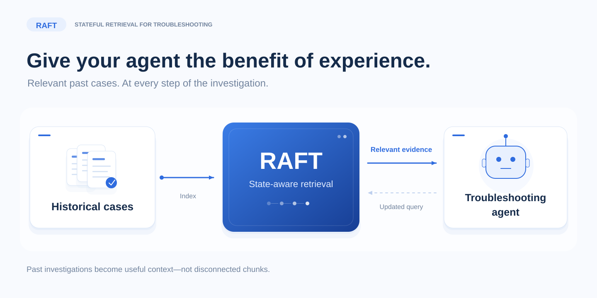
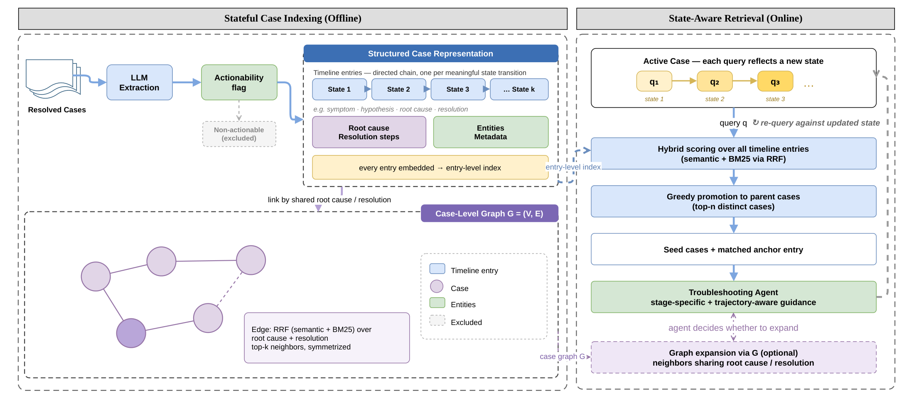
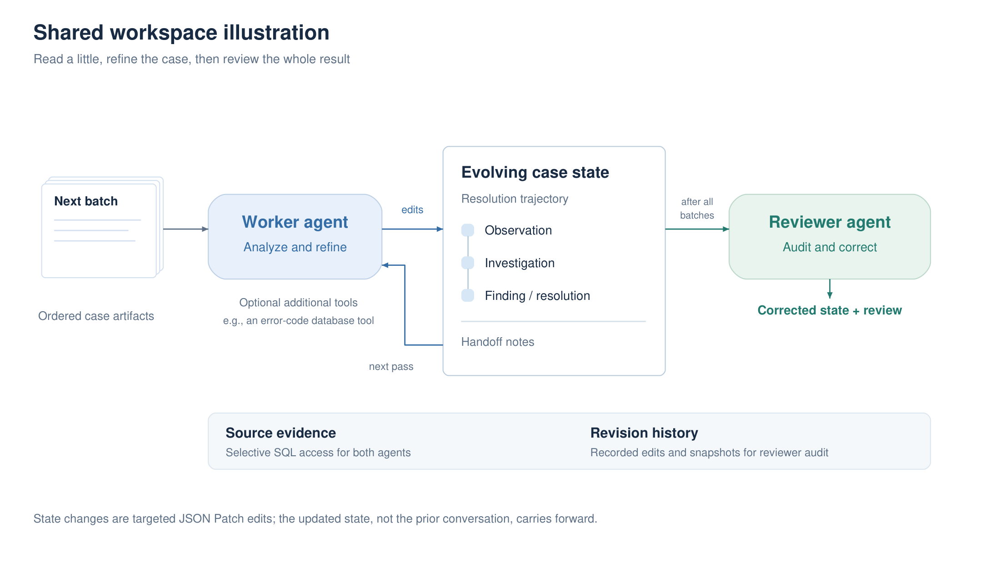

# RAFT

### A Stateful Retrieval-Augmented Framework for Troubleshooting Agents

[](pyproject.toml)
[](https://github.com/openai/openai-agents-python)
[](LICENSE)
[](#paper-and-citation)

*Accepted to **EMNLP 2026, Industry Track**. arXiv preprint coming soon.*

[](assets/raft-hero.svg)

> Retrieve similar troubleshooting states, not just similar documents.

RAFT is built for **technical support cases where resolution takes an investigation,
not a single answer**:

**Initial symptoms → investigation → root-cause confirmation → resolution or mitigation**

It distills noisy conversations, logs, and notes into searchable case trajectories,
with configurable filtering for cases that offer no reusable technical insight.
Your troubleshooting agents can find similar cases at **the right stage of the
investigation**—with the evidence, diagnostic steps, and resolution path together,
rather than scattered across disconnected chunks.

[Overview](#overview) · [Agent workflow](#agent-workflow) · [Quickstart](#quickstart) · [Production usage](#production-usage) · [Citation](#paper-and-citation)

## Overview

[](assets/raft-overview.png)

*Architecture from the paper. The re-query loop belongs to your troubleshooting
agent; RAFT supplies retrieval, not an autonomous resolution agent.*

1. **Distill the case.** Turn dialogue, logs, and notes into a chronological
   timeline of meaningful changes: symptoms, hypotheses, findings, and resolution.
2. **Match the state.** Embed each timeline entry independently and combine vector
   similarity with BM25 through reciprocal rank fusion.
3. **Return the trajectory.** Promote entry matches to distinct parent cases,
   returning the full extracted case and the timeline entry that triggered the match.

An **optional case-level graph** connects cases through a configurable view, such
as root cause and resolution, for expansion beyond the initial matches.

## Agent workflow

[](assets/agent-workflow.png)

RAFT uses the **[OpenAI Agents SDK](https://github.com/openai/openai-agents-python)**
as its agent SDK backend, powering the **worker + final reviewer** workflow:

- **Worker passes** process ordered, whole-artifact batches and refine shared state
  through JSON Patch. State and handoff notes carry forward, rather than the entire
  conversation.
- **Evidence tools** provide selective, read-only SQL access to source artifacts.
  Workers can also use application-defined tools, such as an error-code lookup.
- **Final review** checks the completed extraction against evidence and revision
  history, corrects the state, and returns a separate assessment before optional filtering.

The default output preserves **entities, timeline narratives, confirmed root cause,
and resolution steps**. Unknown conclusions remain `null`; filtered cases retain
their extracted evidence for inspection. Prompts, Pydantic models, embedding text,
and model clients are all replaceable without editing the pipeline.

Start with our [default worker and reviewer prompts](src/raft/defaults/prompts.py),
then modify or replace them for your domain. See the
[example notebook](examples/jira_walkthrough.ipynb) for customization details.

## Quickstart

### 1. Install

Python **3.11+** is required. A Conda environment is optional.

```bash
git clone https://github.com/microsoft/RAFT.git
cd RAFT

conda create -n raft python=3.12 -y
conda activate raft
python -m pip install -e .
```

Optional extras: `azure` for Entra authentication, `voyage` for Voyage embeddings,
and `dev` for development tools.

### 2. Configure credentials

For example, to use OpenAI, create a local `.env` in the repository root or set:

```dotenv
OPENAI_API_KEY=your-api-key
```

For other models, providers, and authentication options, see the OpenAI Agents SDK
[models](https://openai.github.io/openai-agents-python/models/) and
[configuration](https://openai.github.io/openai-agents-python/config/) guides.

Check out our [example notebook](examples/jira_walkthrough.ipynb) for usage guidance.

### 3. Retrieve

Query a configured and indexed `LocalPipeline`:

```python
results = await pipeline.retrieve(
    ["SSO login fails after certificate rotation."],
    top_k=5,
)

for result in results["results"]:
    if result["error"]:
        raise RuntimeError(result["error"])
    print(result["formatted_context"])  # Ready-to-use, budgeted context.
    for hit in result["candidates"]:
        case = hit["case"]
        matched_entry = case.output.timeline[hit["item_index"]]
        print(case.id, matched_entry.narrative)
```

`top_k` caps distinct cases **per query**. `max_chars` caps the exact returned
`formatted_context`, including blank-line separators. The default formatter emits
only **`id`, `metadata`, `output` (extracted state), and `item_index`**—not review
diagnostics or execution history. Cases that would exceed the budget are not added.

Customize the text with `format_case(hit) -> str`. The hit contains the full
`hit["case"]` object, `id`, `entry_id`, scores, and zero-based `item_index` (the
matched position in the embedding text list). For state-only context:

```python
results = await pipeline.retrieve(
    queries, top_k=5, max_chars=16_000,
    format_case=lambda hit: hit["case"].output.model_dump_json(),
)
```

Formatters are synchronous and should not mutate the hit. `used_chars` equals
`len(formatted_context)`; this is a character budget, **not a token limit**.
Structured candidates still contain the full case. Metadata filters and graph
expansion are opt-in.

## Production usage

RAFT's **extraction and embedding stages** are reusable building blocks for production
pipelines: bounded batches, configurable concurrency/retries, and per-case failure
reporting. They return results in memory without saving them. `LocalPipeline` is
provided for quick local experiments—not as a production search service.

For production, process cases incrementally and persist results in a service such as
**[Microsoft Azure AI Search](https://learn.microsoft.com/en-us/azure/search/)**,
which supports vector and hybrid retrieval. There is no need to load or reindex
your entire case collection at once.

```python
# Pseudocode: configure agents/models once; source, storage, and retry queue are yours.
from raft import run_cases, embed_cases

async for batch in case_source.batches(size=100):
    extracted = await run_cases(cases=batch, **extraction_options)
    embedded = await embed_cases(
        cases=extracted["extracted_cases"], **embedding_options
    )
    await production_index.upsert(embedded["embedded_cases"])
    await retry_queue.enqueue(
        extracted["failed_cases"] + embedded["failed_cases"]
    )
```

Your storage adapter maps case records and entry text/vectors to the service schema,
preserving `case_id` and `item_index` so search hits can return the parent case and
matched state. Durable retries, access control, and deployment monitoring belong
to your application; RAFT does not include an Azure AI Search connector.

## Explore the code

| Start here | What it contains |
|---|---|
| [Jira walkthrough](examples/jira_walkthrough.ipynb) | End-to-end notebook with customization notes |
| [Defaults](src/raft/defaults/) | Extraction/review schemas, prompts, and text preparation |
| [Extraction](src/raft/extraction/) | Worker passes, evidence access, state edits, and review |
| [LocalPipeline](src/raft/pipeline.py) | Persistent indexing, reopening, and incremental updates |
| [Retrieval](src/raft/retrieval/) | Entry ranking, case promotion, filtering, and budgets |
| [Graph](src/raft/graph/) | Optional case linking and neighbor expansion |

## Paper and citation

**RAFT: A Stateful Retrieval-Augmented Framework for Troubleshooting Agents**

Mingxuan Zhang, Xiaowen Wang, Anupma Sharan, Zhengyi Chen, Chenyu Diana Zhang,
Shanshan Yang, and Chittibabu Pacharu. Microsoft.

**arXiv: coming soon.** The paper link and final citation will be added when the
preprint is available.

<!-- Replace the placeholder with the arXiv URL and final bibliographic metadata after upload. -->

```bibtex
@misc{zhang2026raft,
  title  = {RAFT: A Stateful Retrieval-Augmented Framework for Troubleshooting Agents},
  author = {Zhang, Mingxuan and Wang, Xiaowen and Sharan, Anupma and Chen, Zhengyi
            and Zhang, Chenyu Diana and Yang, Shanshan and Pacharu, Chittibabu},
  year   = {2026},
  note   = {Accepted to EMNLP 2026, Industry Track. Preprint forthcoming.}
}
```

## License and contributing

Released under the [MIT License](LICENSE). Contributions are welcome; please follow
the [Microsoft Open Source Code of Conduct](CODE_OF_CONDUCT.md). Report security
issues through the process in [SECURITY.md](SECURITY.md), not a public issue.
